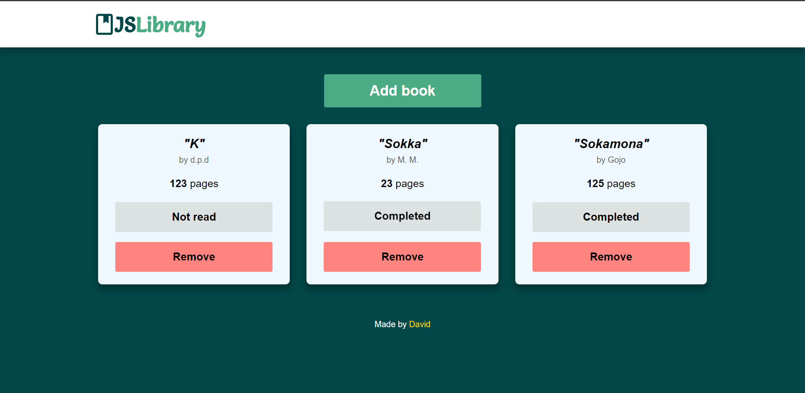

# JavaScript Library
### MVP v1.0

This webpage is a simple book library made to practice working with Object constructors and learning how to organize JS code.

## Technologies Used
- HTML
- CSS (Grid)
- JavaScript

## What I learnt
- Making responsive layouts with CSS Grid.
- Using the object constructor syntax.
- Dinamycally updating a more complex UI and saving changes to an object.

## Challenges and Future Improvements
- Adding local storage.
- Animations.
- Validation to avoid having the same book twice.
